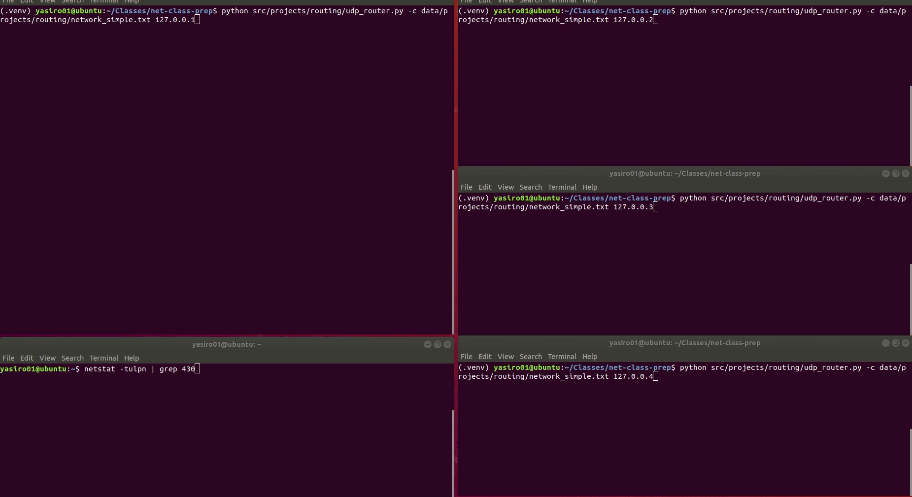

# Trivial Routing Protocol

## Task

In this project you will be writing a set of procedures to implement a distributed asynchronous distance-vector routing protocol. Eventually we may try to make all the routers work together in the lab environment. In order to achieve general compatibility, it's mandatory that you use **Ubuntu 18.04** as a platform and **Python 3.8** as the implementation language.

I recommend you implement your router application in stages, from a basic socket application to a full-fledged router.

This is going to be a challenging project, not only in the sense of correctly implementing the distance-vector routing algorithm but also because your program must handle multiple connections that will operate asynchronously. There are several approaches to correctly deal with a bunch of asynchronous sockets, we are going to use the Python `select` method. The `select` method takes three lists, (sockets I want to **read from**, sockets I want to **write to**, sockets that might have **errors**) and checks all of the sockets lists. When the function returns (either right away, or after a set time), the lists you passed in will have been transformed into lists of sockets that you may want to read, write or check for errors respectively. You can be assured that when you make a read or write call, the call will not block.

I would strongly suggest that you take the time to write yourself a high-level design for this project before you start writing code. You may also find it useful to write a little server program that keeps multiple connections active and adds messages to a queue. Doing something very simple like this is a good way to learn and check out the problems you are likely to run into with asynchronous communications before you get mired in the whole distance-vector routing.

Each router should maintain a set of NEIGHBORS (adjacent routers) and a ROUTING_TABLE as a dictionary in the following format:

```python
{ destination: [cost, next_hop] }
```

## Stage 0: Read the Configuration File

We start with a simple application that takes a router's IP address (127.0.0.**x**) and the configuration file as command-line arguments, reads the configuration, displays the router's status (neighbors and cost of getting to them), and starts listening for incoming UDP connections on port 430**x**. The configuration contains names of your directly connected neighbors and the cost to reach those neighbors.

### Configuration file format

```text
Router_1_IP_address
Neighbor_1_IP_address Cost_of_getting_to_neighbor_1
Neighbor_2_IP_address Cost_of_getting_to_neighbor_2

Router_2_IP_address
Neighbor_1_IP_address Cost_of_getting_to_neighbor_1
Neighbor_2_IP_address Cost_of_getting_to_neighbor_2
Neighbor_3_IP_address Cost_of_getting_to_neighbor_3
```

File *data/projects/routing/network_1_config.txt* represents the following network:


Content of *data/projects/routing/network_1_config.txt*

```text
127.0.0.1
127.0.0.2 1
127.0.0.3 3
127.0.0.4 7

127.0.0.2
127.0.0.1 1
127.0.0.3 1

127.0.0.3
127.0.0.1 3
127.0.0.2 1
127.0.0.4 2

127.0.0.4
127.0.0.1 7
127.0.0.3 2
```

## Stage 1: Welcome to the Party

Start with a socket application that reads network configuration from a file, binds to port 430**x**, and prints the routing table.

## Stage 2: Close Encounters of the Third Kind

1. Your program must connect to the IP addresses specified in the configuration file. Your client should take a path to the configuration file as a command line argument so that we can try out a couple of different configurations. Note that in order to bootstrap the network you are going to need to have your program retry connections that fail.

2. Your program must also receive data from the neighbors which may inform you of a link cost change, or may ask you to deliver a message to a particular IP address.

3. Our protocol will use the following types of messages:

* **UPDATE (0)**
* **HELLO (1)**
* **STATUS REQUEST (2)**
* **STATUS RESPONSE (3)**

The implementation of the first two is required, **STATUS** messages are optional.

### UPDATE message format

* The first byte of the message (0): 0
* Next four bytes (1-4): IP address
* The next byte (5): cost
* The same pattern (IP address followed by cost) repeats.

```text
0       7 8     15 16    23 24    31 32    39
+--------+--------+--------+--------+--------+
|  Type  |           IP Address 1            |
+--------+--------+--------+--------+--------+
| Cost 1 |           IP Address 2            |
+--------+--------+--------+--------+--------+
| Cost 2 |     Another record ...            |
+--------+--------+--------+--------+--------+
```

### HELLO message format

* The first byte of the message (0): 1
* Next four bytes (1-4): source IP address
* Next four bytes (5-8): destination IP address
* The rest of the message (9+): text (characters)

```text
0       7 8     15 16    23 24    31 32    39
+--------+--------+--------+--------+--------+
|  Type  |        Source IP Address          |
+--------+--------+--------+--------+--------+
|  Destination IP Address           |  Text  |
+--------+--------+--------+--------+--------+
|  Continuation of the message text          |
+--------+--------+--------+--------+--------+
```

### STATUS REQUEST message format

* The first byte of the message (0): 2
* Next four bytes (1-4): source IP address of the router requesting the status

```text
0       7 8     15 16    23 24    31 32    39
+--------+--------+--------+--------+--------+
|  Type  |        Source IP Address          |
+--------+--------+--------+--------+--------+
```

### STATUS RESPONSE message format

* The first byte of the message (0): 3
* Next four bytes (1-4): destination IP address of the router requesting the status
* Next four bytes (5-8): IP address
* The next byte (9): cost
* The same pattern (IP address followed by cost) repeats. 

```text
0       7 8     15 16    23 24    31 32    39
+--------+--------+--------+--------+--------+
|  Type  |      Destination IP Address       |
+--------+--------+--------+--------+--------+
|            IP Address 1           | Cost 1 |
+--------+--------+--------+--------+--------+
|            IP Address 2           | Cost 2 |
+--------+--------+--------+--------+--------+
|  Another record ...                        |
+--------+--------+--------+--------+--------+
```

### Event loop

1. Do we have an incoming message?

    1. Accept new connections
    2. Add to the listener list
    3. Add IP addresses to the neighbor list

2. Process incoming messages

    1. If UPDATE, then update the routing table
        * Does my vector change?  If so, then set flag to `update_vector`
        * Print the *updated* routing table
    2. If HELLO, then print or forward to the destination
    3. If STATUS, then respond with the routing table

3. Is `update_vector` flag set?

    1. Send the new vector to all neighbors that can accept data

4. Check my neighbor list against the list of currently connected neighbors

    1. If missing neighbors, then try to initiate connections to them
    2. If successful, then add the new neighbor to list
    3. Send the new neighbor my distance vector

## Stage 3: Routing

Write the following routing functions.

* Read a configuration file for your specific router and add each neighbor to a set of neighbors.

* Build an initial routing table as a dictionary with nodes as keys. Dictionary values should be a distance to the node and the next hop address. Initially, the dictionary must contain your neighbors only.

```python
{'destination':[cost, 'next_hop']}
```

* Format the update message based on the values in the routing table and return the message. For example, a message advertising routes to **127.0.0.1** of cost **10** and to **127.0.0.2** of cost **5** is the following `bytearray`:

```text
0x0 0x7f 0x0 0x0 0x1 0xA 0x7f 0x0 0x0 0x2 0x5
```

* Parse the update message and return `True` if the table has been updated. The function must take a message (raw bytes) and the neighbor's address and update the routing table, if necessary.

* Print current routing table. The function must print the current routing table in a human-readable format (rows, columns, spacing).

* Parse a message to deliver. The function must parse the message and extract the destination address. Look up the destination address in the routing table and return the next hop address.

* Router works with properly implemented routers of other students.

## Functions

See the source code template file for function signatures.

### read_config_file()

* Read a configuration file for your specific router and add each neighbor to a set of neighbors.
* Build an initial routing table as a dictionary with nodes as keys.
* Dictionary values should be a distance to the node and the next hop address (i.e. {'destination':[cost, 'next_hop']}).
* Initially, the dictionary must contain your neighbors only.

### print_status()

* Print current routing table.
* The function must print the current routing table in a human-readable format (rows, columns, spacing).

### format_update()

* Format the update message based on the values in the routing table.
* The message advertising routes to 127.0.0.1 of cost 10 and to 127.0.0.2 of cost 5 is a `bytearray` in the following format

```text
0x0 0x7f 0x0 0x0 0x1 0xA 0x7f 0x0 0x0 0x2 0x5
```

* The function must return the message.

### send_update()

* **Optional** (not tested) function that can be used to send the update message to another router

### parse_update()

* Parse the update message and return `True` if the table has been updated
* The function must take a message (raw bytes) and the neighbor's address and update the routing table, if necessary.

### format_hello()

* Format the message according to the rules specified above.

### send_hello()

* **Optional** (not tested) function that can be used to send the text message to another router

### parse_hello()

* Parse a message to deliver.
* The function must parse the message and extract the destination address.
* If *this* router is the destination, return (and print) the message, else forward it further
* Look up the destination address in the routing table and return the next hop address.

## Testing the implementation

```bash
python -m pytest tests/projects/routing/test_router.py
```

## Running the simulation

Start each router as follows (preferably, in separate windows):

```bash
python src/projects/routing/udp_router.py -c data/projects/routing/network_1_config.txt 127.0.0.1
python src/projects/routing/udp_router.py -c data/projects/routing/network_1_config.txt 127.0.0.2
python src/projects/routing/udp_router.py -c data/projects/routing/network_1_config.txt 127.0.0.3
python src/projects/routing/udp_router.py -c data/projects/routing/network_1_config.txt 127.0.0.4
```

Alternatively, start all of them at once:

```bash
./tests/projects/routing/run_simulation.sh
```



### Capturing the traffic

Use the provided dissector *trivial_routing_protocol.lua* to see routing messages in Wireshark.

```bash
wireshark -X lua_script:trivial_routing_protocol.lua routing_capture.pcapng &
```

## Grading

| Functionality (* signifies a unit test is available) | Points  |
| ---------------------------------------------------- | ------- |
| *Read network configuration file                     | 10      |
| *Handle error(s) while reading the config file       | 10      |
| *Format UPDATE message                               | 10      |
| *Parse UPDATE message and update DV                  | 10      |
| *Parse UPDATE message and ignore it                  | 10      |
| *Format HELLO message                                | 10      |
| *Parse HELLO message and display it                  | 10      |
| *Parse HELLO message and forward it                  | 10      |
| Display router's Distance Vector                     | 10      |
| Send UPDATE message to all neighbors on boot         | 10      |
| Send UPDATE message to all neighbors occasionally    | 10      |
| Receive UPDATE message from any neighbor             | 10      |
| Send HELLO message                                   | 10      |
| Receive HELLO message                                | 10      |
| Keep running until manually closed                   | 10      |
| **Total**                                            | **150** |
| Syntax errors                                        | -20     |
| Application crashes                                  | -20     |
| Spamming the neighbors                               | -20     |
| Sending problem(s)                                   | -20     |
| Receiving problem(s)                                 | -20     |
| **Penalty**                                          | **-100**  |

## References

* [socket — Low-level networking interface — Python 3.7.1 documentation](https://docs.python.org/3/library/socket.html)

* [select — Waiting for I/O completion — Python 3.7.1 documentation](https://docs.python.org/3/library/select.html)
